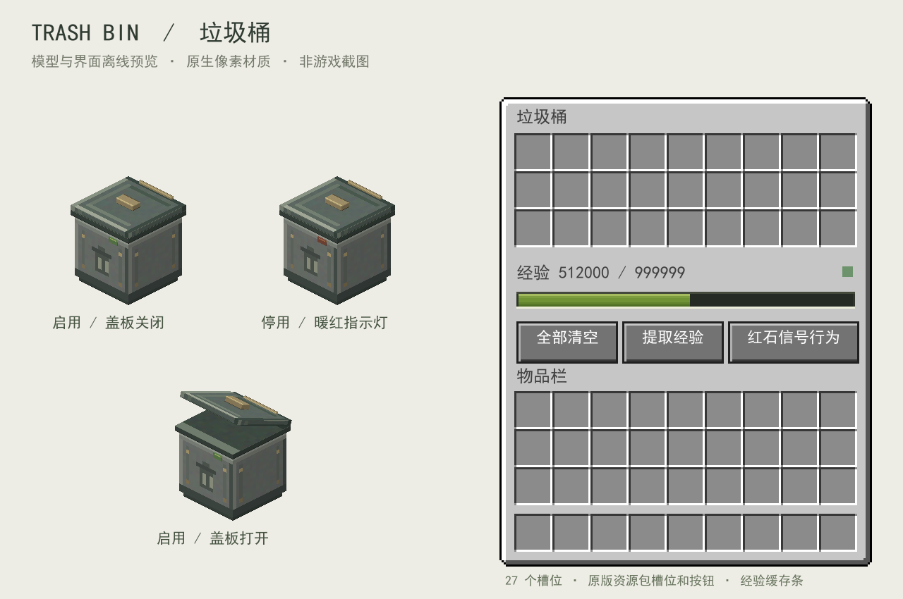

# Trash Bin / 垃圾桶

Forge 垃圾桶 Mod，提供 27 格手动储物、FIFO 自动化垃圾处理、物品/液体经验回收和可选液态经验输出。无需任何额外前置 Mod。



## 安装

将 `dist/` 中对应 Minecraft 版本的一个 jar 放入客户端及服务器的 `mods` 文件夹。三个 Minecraft 版本分别使用自己的 jar，不能混用。

| Minecraft | 开发与测试使用的 Forge | 文件 |
| --- | --- | --- |
| 1.18.2 | 40.3.12 | `trashbin-forge-1.18.2-1.0.0.jar` |
| 1.19.2 | 43.5.2 | `trashbin-forge-1.19.2-1.0.0.jar` |
| 1.20.1 | 47.4.23 | `trashbin-forge-1.20.1-1.0.0.jar` |

需要 Java 17。方块 ID 为 `trashbin:trash_bin`。创造物品栏有独立的「垃圾桶」分类；生存合成材料为 1 个木桶和 4 个铁锭。

```text
   铁
铁 桶 铁
   铁
```

## 使用与经验规则

- 右键打开 9×3 储物格。手动放入、拖动、快捷移动遵守普通容器规则，满仓时拒绝放入，不会触发销毁。
- 「全部清空」永久销毁全部物品，按数量转化为经验点。手动转换的溢出经验在操作玩家脚下生成经验球。
- 「提取经验」将整点经验缓存以经验球形式释放在操作玩家位置，小数经验和转换余数保留。
- 所有方向均提供标准 Forge `IItemHandler` 和 `IFluidHandler`，支持漏斗及使用这些接口的管道、溜槽、总线。
- 自动输入优先使用空槽和可合并的栈。如果全部槽位无法接收该物品，销毁最早放入的一组，接收新物品。合并进现有栈不刷新该组的时间；移空或替换后重新计时。
- 自动化转换产生的缓存溢出经验直接丢弃，不生成经验球，输入仍可继续；应使用液态经验输出处理持续产出。
- 液体进入时直接销毁，不占储物格，也不会在内部混合或保留。各种液体使用相同的输入转换比例。
- 物品和液体各自保存转换余数，并跨次、跨区块卸载、跨存档重启累计。默认两次清空各 32 个物品可以得到 1 点经验；512 桶液体可以得到 1 点经验。
- 使用整数计算保存 1/20 经验点的精度，防止小额液态输出产生经验复制或损失。尚未达到 1 点的回收余数可以查看和维护于存档，整点提取不会将其舍弃。

## 配置

进入世界后，Forge 生成世界专用配置：`<世界目录>/serverconfig/trashbin-server.toml`。服务器同样使用其世界的 `serverconfig`。通过 `defaultconfigs/trashbin-server.toml` 可设置新世界默认值。

```toml
[recycling]
experienceCapacity = 999999
itemsPerExperience = 64
fluidMillibucketsPerExperience = 512000
```

所有数值均指**经验点数**，并非经验等级。经验容量允许 1～1,000,000,000；两种输入比例允许 1～2,147,483,647。修改比例后，已有的未转换物品数/液体量余数按新比例在下一次回收时结算。降低容量时超出的旧缓存会被舍弃，建议先提取再修改。

## 可选液态经验输出

| 已安装且注册了对应流体 | 输出流体 | 输出倍率 |
| --- | --- | --- |
| Create Enchantment Industry | `create_enchantment_industry:experience` | 1 经验点 → 1 mB |
| Sophisticated Core | `sophisticatedcore:xp_still` | 1 经验点 → 20 mB |
| 两者都有 | 优先 CEI | 1 经验点 → 1 mB |
| 两者都没有 | 无流体输出 | 仍支持液体销毁输入 |

输出使用对应 Mod 原生经验单位，输入始终使用垃圾桶的液体回收比例。垃圾桶无需这些 Mod 的类，也不会自行安装它们或它们的前置。管道从任意面主动抽取即可；方块不会主动向邻居推送。

## 红石、外观与掉落

「红石信号行为」依次循环：无 → 充能时启用 → 未充能时启用。默认「无」。模式同时控制自动化物品输入/输出与流体输入/输出；手动 GUI 操作始终可用。启用时指示灯为暗绿，停用时为暖红，打开界面时盖板掀起。

方块适合镐挖掘，但空手或其他工具也会掉落。挖掘、爆炸或替换方块会弹出存储物品及整点经验；掉落的垃圾桶物品始终为空，不携带库存、经验或模式。无法形成整点经验球的小数和未转换余数在方块销毁时舍弃。开关盖使用木桶声音；挖掘和脚步使用灯笼声音。

附加的轻量功能是比较器输出：按普通容器的填充比例输出 0～15 信号。支持中文与英文。

GUI 使用资源包的 `minecraft:textures/gui/container/generic_54.png` 槽位与边框，按钮使用原生组件。方块使用普通 JSON 模型与可替换 PNG，不依赖自定义渲染器。资源包作者的覆盖路径见 [资源包说明](docs/RESOURCE_PACKS.md)。预览图是离线模型/布局校样，并非客户端截图。

## 开发

```powershell
# 自动选择 Java 17，依赖缓存仅存放在项目 .tools 中
.\scripts\build.ps1
# 单个版本构建
.\scripts\build.ps1 -Minecraft 1.20.1
# 启动开发客户端
.\scripts\build.ps1 -Minecraft 1.20.1 -Task :forge-1.20.1:runClient
# 实际 Forge 服务器集成测试（测试类不进入发行 jar）
.\scripts\build.ps1 -Minecraft 1.20.1 -Task :forge-1.20.1:runGameTestServer -GameTests
# 测试专用流体注册：检查精妙经验小额输出、或 both 检查 CEI 优先
.\scripts\build.ps1 -Minecraft 1.20.1 -Task :forge-1.20.1:runGameTestServer -GameTests -Compatibility sophisticated
```

Linux/macOS 使用 Java 17 和 `./gradlew release`，单版本通过 `-Pmc=1.20.1` 选择；测试使用 `./gradlew -Pmc=1.20.1 -PgameTests=true :forge-1.20.1:runGameTestServer`。

运行 `python scripts/verify_jars.py` 检查三个发行 jar 并生成 `dist/SHA256SUMS.txt`。可选兼容测试通过独立测试流体覆盖注册 ID、优先级和输出接口，不加载或复制第三方 Mod，不能替代整合包实机联调。

运行 `python scripts/generate_assets.py` 可重建全部原始材质、模型与数据文件；不需要第三方 Python 包。更详细的维护结构与验证范围见 [维护文档](docs/MAINTENANCE.md) 和 [验证记录](docs/VALIDATION.md)。

NeoForge 尚未发布支持版本。无游戏依赖的经验/FIFO/红石规则置于 `core/`，版本差异集中在 `VersionPlatform` 与两个 GUI 适配器中，后续可增设加载器实现。

## GitHub CI 与发布

每次向任意分支推送提交、创建或更新 Pull Request，GitHub Actions 自动构建三个版本，运行核心测试和三种流体环境下的服务器测试。全部通过后检查发行包并生成 SHA-256 校验和，可在该次运行的 `trashbin-release` artifact 中下载三个 jar 和 `SHA256SUMS.txt`。

推送任意 tag 会执行相同检查，成功后自动创建对应的 GitHub Release，上传全部三个 jar 与校验和，并生成发布说明。发布只使用 GitHub 自带的 `GITHUB_TOKEN`，无需额外 secret。若上传失败，Release 保持草稿；重跑可恢复草稿，已经公开的 Release 不会被覆盖。

发布新版本时，先修改 `gradle.properties` 中的 `mod_version` 并提交、推送，再为该提交添加和推送对应 tag，例如：

```sh
git tag v1.0.1
git push origin v1.0.1
```

tag 本身不会更改 jar 内的版本号。工作流和发布逻辑分别见 [.github/workflows/build.yml](.github/workflows/build.yml) 与 [scripts/publish_release.sh](scripts/publish_release.sh)。

本项目代码和原创资产采用 [MIT 协议](LICENSE)，发行 jar 中同时包含许可证文本。

Forge 开发环境参考：[Forge 官方说明](https://docs.minecraftforge.net/en/1.20.1/gettingstarted/)。可选输出单位参考：[CEI 的兼容配方](https://github.com/DragonsPlusMinecraft/CreateEnchantmentIndustry/blob/1.20.1/0.5.1-dev/src/main/resources/data/create_enchantment_industry/recipes/compat/sophisticatedcore/mixing/experience_conversion.json) 和 [Sophisticated Core XpHelper](https://github.com/P3pp3rF1y/SophisticatedCore/blob/1.20.x/src/main/java/net/p3pp3rf1y/sophisticatedcore/util/XpHelper.java)。未复制第三方 Mod 的源码或美术资产。
